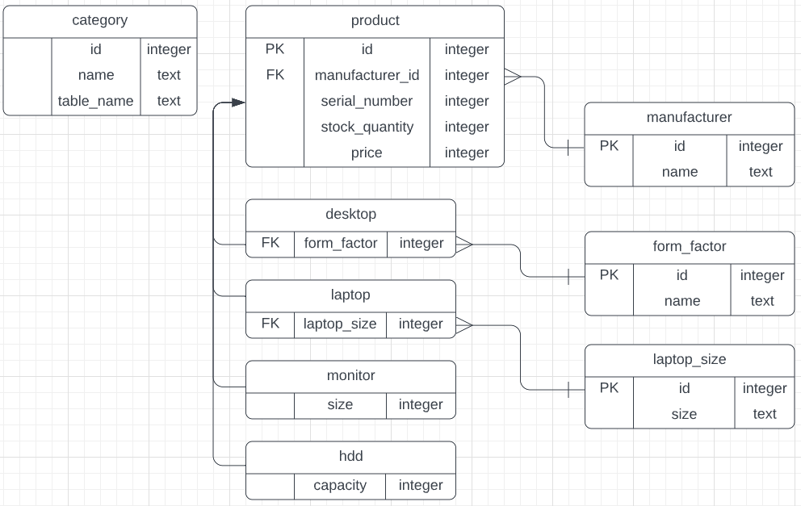

# Используемые технологии
* Java 19
* Maven 3.9.1
* Spring Boot 3.0.4
* H2 Database
* Hibernate-validator 8.0.0
# Структура базы данных
 
Таблица `product` содержит свойства, которые имеет каждый тип товара. 
Производитель хранится в виде внешнего ключа таблицы-справочника `manufacturer`
в которой хранятся имена производителей. 
Таблицы `desktop`, `laptop`, `monitor` и `hdd` наследуются от таблицы `product`
и содержат дополнительные свойства товаров. Форм-фактор и размер ноутбука
так же, как и производитель, хранятся в соответствующих таблицах-справочниках. 
Таблица `category` содержит название типа товара и имя таблицы в которой хранится названный тип товара. 
# Реализация
Результат разработки представляет собой HTML-страницы, которые имеют RESTful HTTP методы выполняющие:
1) Добавление товара
2) Редактирование товара
3) Удаление товара
4) Просмотр всех существующих товаров по типу
5) Просмотр товара по идентификатору
# Cборка проекта
Для сборки проекта необходимо иметь установленный в системе Apache Maven. 
Сборка проекта производилась для Windows 10.
1) В командной строке переходим в папку проекта
2) Запускам команду `mvn package`
3) Ждём сообщения `BUILD SUCCESS`
4) Запускаем программу `java -jar target/ShiftLabTest-0.0.1.jar`

Результат можно протестировать перейдя по ссылке: http://localhost:8080/categories  
Порт по умолчанию `8080`.
Поменять его можно в файле `application.properties` раскомментировав строку `server.port=` и написав желаемый порт.
